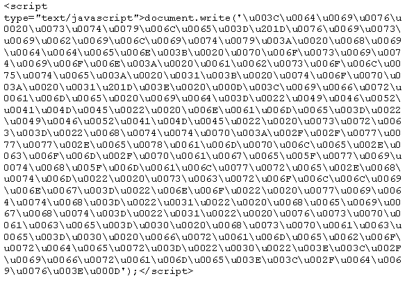
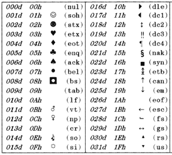
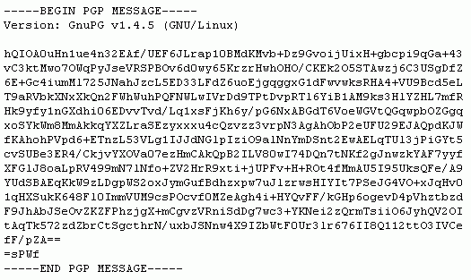
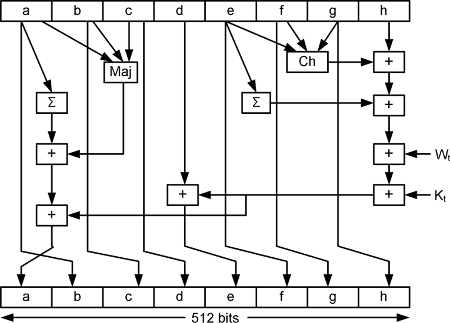
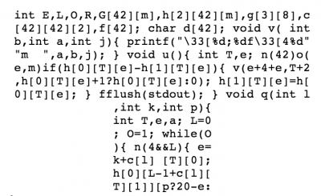

[原文阅读](https://danielmiessler.com/study/encoding-encryption-hashing-obfuscation/)

[编码](#编码)

[加密](#加密)

[散列法](#散列法(哈希))

[混淆](#混淆)

很多人都对编码，加密，哈希，混淆的不同点感到[疑惑](http://www.google.com/search?sourceid=chrome&ie=UTF-8&q=what%27s+the+difference+between+encoding+and+encryption%3F)，我们一个一个解释：

### 编码
 
 

编码的目的是将数据转换，使其能被各类不同的系统正确(安全)的解析。例如：email发送的是二进制数据，在web上查看特殊字符。
它的目的*不是*为了让数据更安全，而是能让数据被正确的解析。

编码通过一些公开可用的方案将数据转换成另一种格式，因此它是可逆的。对编码进行解码不需要密钥，仅仅需要生成这个编码的算法。

例子：[ASCII](http://www.asciitable.com/), [UNICODE](https://danielmiessler.com/study/encoding/#unicode), [URL ENCODING](http://www.eskimo.com/~bloo/indexdot/html/topics/urlencoding.htm), [BASE64](https://en.wikipedia.org/wiki/Base64)

加密

加密的目的是转换数据以使其对其他人保密，例如:通过互联网向某人发送一封只有他们才能阅读的秘密信件，或者安全地发送密码。
比起关注适用和易用性，加密的目的是确保除了预期接收者之外的任何人都不能解读数据。

加密将数据通过某种方式转换为另一种格式，使得只有特定的个人可以解密。 它通过私有密钥，结合数据内容和算法执行加密操作。
因此，对加密内容的解密需要密文，算法和密钥缺一不可。

例子：[AES](http://www.aes.org/), [BLOWFISH](https://en.wikipedia.org/wiki/Blowfish_(cipher)), [RSA](http://www.rsa.com/)

### 散列法(哈希)

散列法的目的是确保完整性，也就是说，当数据内容发生变化时你可以知道它已被更改。
从技术上讲，散列对任意输入都会生成固定长度字符串，它符合以下特性：

1. 输入相同，输出一定相同
2. 绝大部分不同的输入不应该产生相同的输出
3. 输入到输出行为不可逆
4. 对输入值的修改会导致输出产生巨大的改变

散列法与认证结合使用，确保某个特定的消息未被修改。 它的实现通过对需要传送的消息进行散列处理，然后使用发送方的密钥对这个散列值加密。

当接收方收到消息时，他们可以使用发送方的公钥解密出散列值，然后自己对邮件进行散列处理，并将自己处理得出的散列值与发送方传来的的散列值进行比较。 如果能匹配则是一个未修改的消息。

例子：[SHA-3](https://en.wikipedia.org/wiki/SHA-3), [MD5 (已经废弃)](https://en.wikipedia.org/wiki/MD5), 等等。

### 混淆

混淆的目的是使某些东西更难理解，通常是为了使攻击或复制更加困难。

一个常见的用途是混淆源代码，使得这个项目难以被逆向工程。

重要的一点，混淆并不是一个安全的保护措施(例如加密），而是一个干扰。
它与编码一样，通常可以通过使用对数据混淆的算法来逆转，或者通过一个耗时的人工处理。

关于混淆的另一个关键点，根据对要进行混淆的内容不同，混淆代码的程度是有限制的。
例如，如果你要对代码进行混淆，必须要保证混淆的结果仍然可以被计算机解析，否则程序将停止运行。

例子: [JAVASCRIPT OBFUSCATOR](https://javascriptobfuscator.com/), [PROGUARD](http://proguard.sourceforge.net/)

### 总结

编码用于维持数据能合适的使用，并且可以通过采用对内容进行编码的相同算法来逆转，不需要密钥。

加密用于维护数据机密性，并且需要使用密钥（保密）才能获取原数据。

散列法用于通过检测数据散列值是否有明显改变，来验证数据内容的完整性。

混淆用于防止人们理解某些内容，经常用于混淆代码以防止逆向工程和盗窃产品的功能。

-------------------
*注意*：

有人可能会问，何时使用混淆而不是加密，答案是混淆后的内容能使一个实体（如人类）更难理解，但其他一些东西（如计算机）能轻易解析。
而通过加密后的内容，人和计算机都无法在没有密钥的情况下解析内容。

