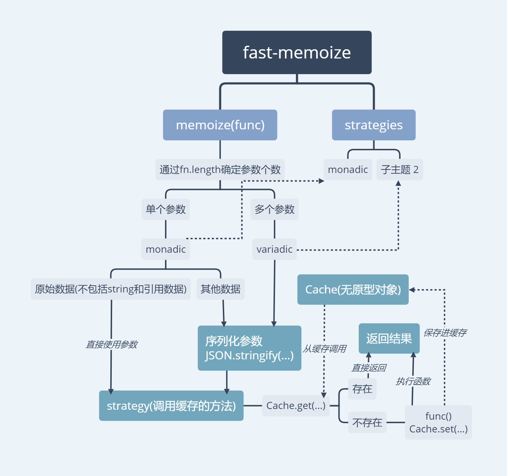

## nano-memoize 和 fast-memoize

首先，这2个工具的实现源码是极其相似的，基本上，只要阅读了其中一个源码，也就了解了另外一个的实现。

fast-memoize导图：

大概说说它们的实现思路：

1. 定义缓存结构，其中`fast`使用了`无prototype的对象`，`nano`使用了`普通对象`。
2. 定义序列化方法：当检测到是单参数时，都是选择JSON.stringify，而多个参数，两者有不同（后面再说）。
3. 定义策略：也就是缓存的具体方法，其实很简单，就是对当前缓存结构查找，找到就返回，找不到就重新运行，
    两者都使用了`bind`方法注入参数，可以省去运行时再去查找参数。
    
接着分析两者的异同：

相同处：

* 都使用了`JSON.stringify`作为序列化方法，因为它是原生的。
* 都对返回的缓存函数进行了参数注入（这是一个极大提升性能的方法）。
* 对单参数还是多参数的判断都是使用`func.length`(形参的数量判断)，因为`func.length`比`arguments.length`这种动态判断性能会好很多。

不同点：
* `fast`使用了`无prototype的对象`，`nano`使用了`普通对象`(这一点性能上相差不多)。
* 当遇到多个参数时，`fast`还是继续对`arguments`进行序列化，而`nano`则复杂一点，它通过用数组将每一次多个参数保存起来，
后续通过遍历每个参数进行全等对比`===`，判断是否从缓存调取结果。
* 同样是多个参数，`nano`增加了一个参数max，可以让用户自定义需要进行对比参数的长度。

[更详细的说明和深入理解，可查看源码学习——fast,nano](https://github.com/stonehank/sourcecode-analysis/blob/master/source-code.fast-memoizeVSnano-memoize/README.md)

假设：
* 忽略===的执行时间
* 使用的参数分为 引用相同 和 引用不同(但是深比较为true)

|*耗时操作*|*多个参数(引用相同)*|   |*多个参数(引用不同)*|    |
|------|--------|---------|----------|----------|
|状态  |首次运行 |后续运行|首次运行  |  后续运行|
|fast  |序列化+运行|序列化|序列化+运行|序列化|
|nano  |运行|0|运行|运行|

