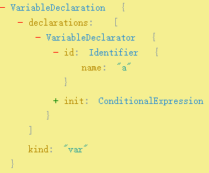

## 回顾

在这一片文章中，我构建一个获取函数参数名的工具，是通过`esprima`去解析`AST`并对其进行分析判断。

通过对`AST`的分析，几乎能兼容所有函数和参数的写法，这是因为它是从语义上分析代码。

## 问题

但使用的同时，也发现了3个问题，**第1个是致命的**。

1. babel编译。

    当我们很爽的写着ES6函数的时候，`babel`会将你的参数格式彻底打乱。
    
    例如：
    
    ```js
    let sum=(a=2,b=3)=>{
      console.log(a+b)
    }
    ```
    编译后，没有参数了，工具彻底失效。
    ```js
    var sum = function sum() {
      var a = arguments.length > 0 && arguments[0] !== undefined ? arguments[0] : 2;
      var b = arguments.length > 1 && arguments[1] !== undefined ? arguments[1] : 3;
      console.log(a + b);
    };
    ```

2. 动态编译。

    必须要等到程序开始运行后才能工作，这意味着要将整个`esprima`库放入到项目中，除非你的项目中已经有依赖
    `esprima`，否则为这个功能会带来额外的体积开销。

3. 性能。

    由于是运行时才开始执行分析`AST`树，这意味着你的首屏时间又双叒叕增加了...

## 解决方案

当前最需要解决的就是如果适应babel编译。

很显然，那就是要抢在babel编译之前，这就请出今天的主角，**babel插件**。

首先简要说明一下，babel是怎么编译你的代码的，`AST`树。

例如上面的函数

```js
let sum=(a=2,b=3)=>{
  console.log(a+b)
}
```

babel会检测到是一个`ArrowFunctionExpression(箭头函数表达式)`，然后继续检测，
发现参数是`ExpressionStatement(表达式语句)`，符合修改的要求，于是构造出这两句的`AST`树

```js
var a = arguments.length > 0 && arguments[0] !== undefined ? arguments[0] : 2;
var b = arguments.length > 1 && arguments[1] !== undefined ? arguments[1] : 3;
```

其中一条`var a=...`的`AST`如下，具体可以这里尝试，[https://astexplorer.net/](https://astexplorer.net/)



并将其插入到当前的`BlockStatement(大括号作用域内)`

检测和构造，就是babel，也是babel插件的核心。

## AST节点修改

正式开始，先从一个简单的结构看起，一个官方插件`@babel/plugin-transform-object-assign`，作用是将`Object.assign`
转换成`_extends`，这个`_extends`是一个预定义的方法。

```js
import { declare } from "@babel/helper-plugin-utils";
export default declare(api => {
  api.assertVersion(7);
/*----------以上是确认版本判断功能是否存在---------*/
  return {
    visitor: {
      CallExpression: function(path, file) {
        if (path.get("callee").matchesPattern("Object.assign")) {
          path.node.callee = file.addHelper("extends");
        }
      },
    },
  };
});
````
从第6行开始
* `visitor`指的是访问者模式，简单来说就是我们遍历`AST`树，每次遍历一个节点，都会进入visitor执行我们的代码。

* `CallExpression`说明我们要找的相关语义是`调用表达式`，它是一个函数，有2个参数`path`和`file`，

* `file`这里调用了addHelper方法，用的比较少，暂时搁着。

* `path`相当是一个连接对象，它里面的属性可以连接到各个我们需要的对象，例如如果我们要找到`CallExpression`对象本身，
那么就是进入`path.node`，如果要找它的父节点，进入`path.parent`等等

    >个人理解：要尽快进入`path.node`，而不要在`path`上做过多判断甚至是遍历，
    因为它是一个包含了所有节点的path的对象，它的作用就是让我们快速到达想要找的节点，
    如果在`path`上面一层层寻找(我就这么干了！)，身心俱疲...

继续回到例子

* `path.get("callee")`，因为这是一个`CallExpression`，它一定有一个`callee`属性，
    通过`.get`可以快速查找，相当于`path.node.callee`。

* `.matchesPattern("Object.assign")`字面意思，匹配到`Object.assign`这个字样。

* `path.node.callee = file.addHelper("extends")`就是将`callee`属性重新设置成`_extend`，
这里的`file.addHelper("extends")`返回的也是一个`AST`对象，`Identifier{type:"Identifier ",name:"_extend"}`，
这是一个标识符，像变量，参数，属性的名称等都是标识符。

    记住，要在`AST`树上插入的内容一定也要是`AST`对象。

看到吗，就这么多，很好理解吧，因为这里只是修改了一个属性，并没有增加。

## AST节点增加

在这一块，我被困扰了好几个小时，主要还是概念太过缺失，现在总结起来。

1. 每一个AST节点都是一个对象，这个对象内部有必须的属性(type是必须的)，也有非必须的属性，例如：

    `ArrayExpression(数组表达式)`，也就是数组，必须的属性只有1个，`elements`，它的元素
    
    那么就可以想象一下，它的最简单`AST`树结构就是
    
    ```
    {
      type:"ArrayExpression",
      elements:[]
    }
    ```
    但查找时会发现，默认的树还有其他许多属性，例如`start`,`loc`等等，这些我们在创建的时候，可以不必理会。
    
2. 创建方式有多种，分为2类，使用工具创建和不使用工具创建。

    当然，最开始我是不使用工具的，当时写一个对象结构里面的`key`属性是字符串，`value`属性是数组(并且有的有可能多层嵌套)，
    然后开始一个个节点对象创建，递归，遍历，写啊写，写完执行，失败，好吧，一层一层的剥开调试...这就是写bug的正确方式。
    
    好吧，`ctrl+a -> del`，这里只讲我使用的方式。
    
    安装`@babel/core`，引入`import {template,types as t} from "@babel/core"`
    
    * `template`
    
    用来创建模板的，能少写很多东西，例如：`template("let x=SOMEVALUE")`
    这里只需要在后面传入`SOMEVALUE(要大写)`的值，就会自动创建出`let x=xxxx`这个表达式的`AST`对象。
    
    * `types`
    
    用来创建单个节点对象的。
     或许我只想简单创建一个字符串，那么就是`t.stringLiteral("这里是要创建的字符串")`，
    
    创建一个数组，那么是`t.arrayExpression(elements)`，
    
    也就是使用`t`的节点名称方法，传入这个节点必须的属性就可以了，你只需要了解你的代码对应的语义，
    最后拼接，例如 一个有3个字符串作为元素的数组：
    
    `t.arrayExpression([t.stringLiteral("a"),t.stringLiteral("b"),t.stringLiteral("c")])`
    
    简洁高效。
    

## 总结

关于AST的操作还有很多，例如删除，替换...具体可以看`bable-handbook`，这篇文章说的修改和增加，内容不深，主要是让我们对AST
的结构，并且是如何通过它去创建babel插件能有一个概念，接下来的更多发掘就靠自己的探索了。