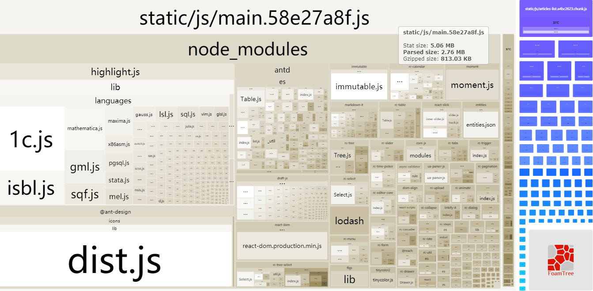
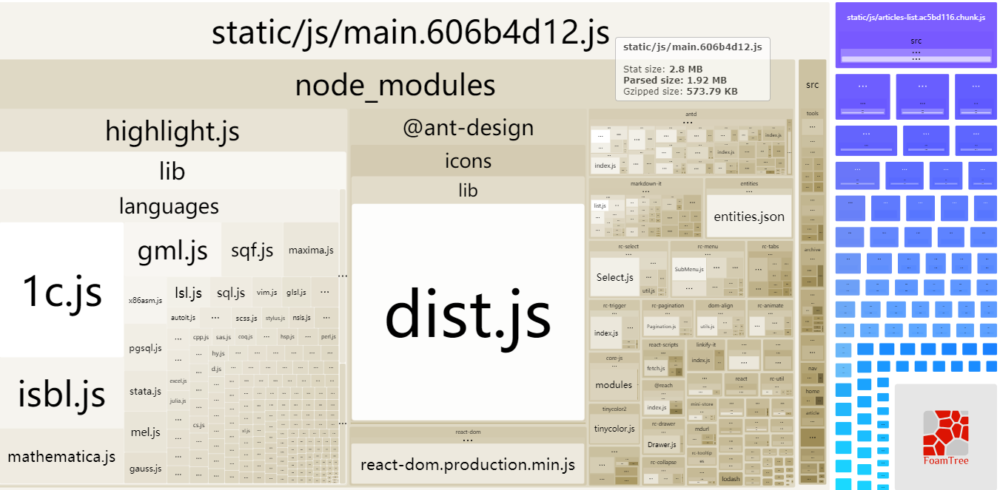
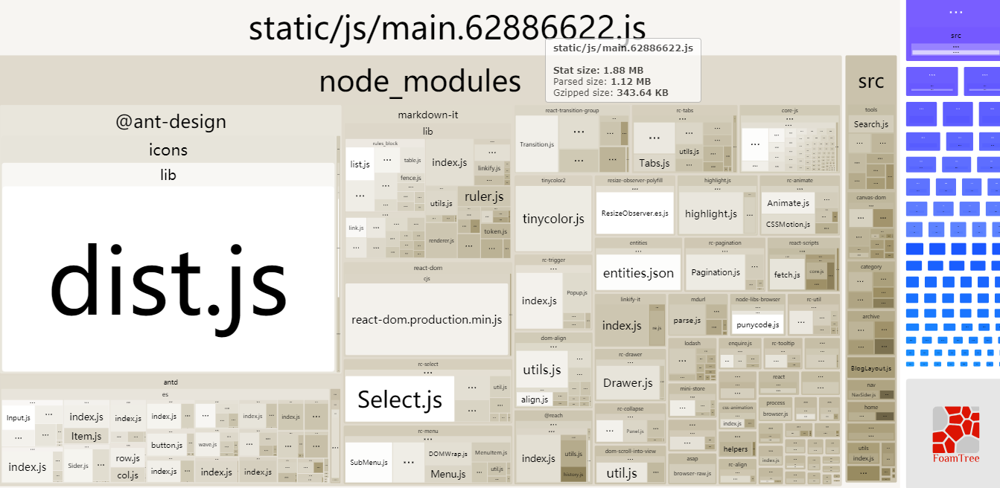
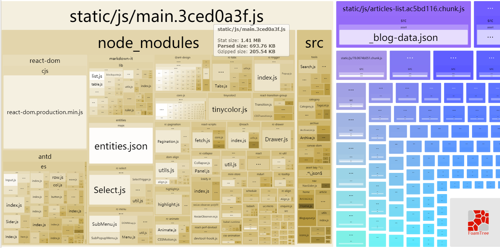

这是一个个人博客，基于`antd`搭建，这个项目构建流程如下：
1. 先启动`fetch-blog-serve`，这是一个能将你的`repertory`的blog内容拉去到本地，并且写入`xxx.json`。
2. 在写入之前会生成一个列表，包含每一篇blog的标题、日期、标签、摘要、sha值(唯一性判断)。
3. 前端通过获取数据，对数据进行处理，分配给各个板块。
4. 其中渲染`.MD`使用了`markdown-it`和`highlight.js`(`react-markdown`使用时出现了一些格式偏差，就没有用了)。
5. UI组件都是使用`antd`。

构建开始，我使用了`webpack-bundle-analyzer`来查看各个bundle的大小。

因为是`create-react-app`构建，需要使用`react-app-rewire`。

第一次构建，总大小2.76M



很显然是不行的，一个个人博客而已...

因为我们使用了`antd`,而当这么写`import {Button} from 'antd'`的时候，会加载所有组件，

使用`babel-plugin-import`作为webpack插件，加入到`config-overrides.js`中，这里的config指
webpack的config配置。

```js
config = injectBabelPlugin(
  ['import', { libraryName: 'antd', libraryDirectory: 'es', style: 'css' }],
  config,
);
```
具体见[官网](https://ant.design/docs/react/use-with-create-react-app-cn#%E9%AB%98%E7%BA%A7%E9%85%8D%E7%BD%AE)

第二次构建，效果很好，减少了将近800K，总大小1.92M



看了看最多的就是`highlight.js`，这是一个针对代码语言进行高亮，美化的工具。

>当默认加载 `import hljs from "highlight.js"`的时候，会加载所有语言的渲染组件。

应该使用按需加载(这里只加载js的渲染组件)：
```
import hljs from 'highlight.js/lib/highlight';
import javascript from 'highlight.js/lib/languages/javascript';
hljs.registerLanguage('javascript', javascript);
```

第三次构建，又减了800K，总大小1.12M



很明显一个大大的`dist.js`刺激着我的眼睛。

往上一看，原来是`antd`的Icon组件，这是怎么回事？上官网一查

>⚠3.9.0 之后我们全量引入了所有图标，导致 antd 默认的包体积有一定增加，我们会在不远的未来增加新的 API 来实现图标的按需使用，更多相关讨论可关注：[#12011](https://github.com/ant-design/ant-design/issues/12011)。

看了看讨论的情况，目前最好的临时解决方案就是，通过webpack的`resolve.alias`，让`antd`里的所有组件的
图标获取转到一个自定义文件中，这个自定义文件将会按需导出。

具体看这里:[https://github.com/ant-design/ant-design/issues/12011#issuecomment-420038579](https://github.com/ant-design/ant-design/issues/12011#issuecomment-420038579)

搭建好自定义的`icons.js`后，还是在`config-overrides.js`中，

```js
config.resolve.alias['@ant-design/icons/lib/dist$']=path.resolve(__dirname, './src/icons.js')
```

第四次构建，再次减少400K后，总大小为693K，这个结果是可以接受的。



这就是我的一次项目构建体积压缩全过程。