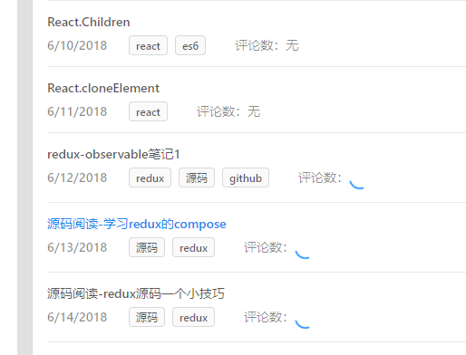
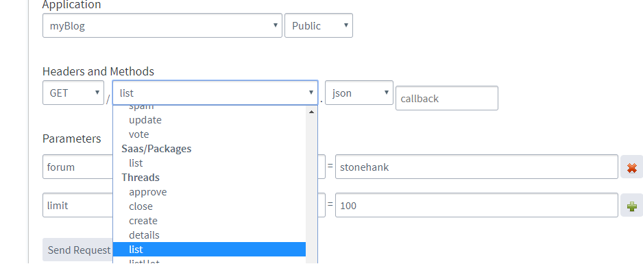
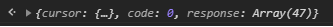
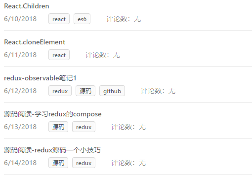

博客添加了`disqus`，并且在文章列表处每一篇标题边上添加一个评论计数器。

它通过`identifier`去获取，`identifier`在文章详情页面提供配置。

问题是：**这个计数器并不是每一篇文章都能正确显示**，有的列表能显示2个，有的列表一个都不显示，

看了看network，不能显示的文章response是个空数组，是不是服务器获取失败呢还是没有上传到服务器呢。

第一次尝试，将计数器获取的配置`identifier`改成一个静态的并且有效的(已经能获取到的)，
结果能显示，说明获取计数值这个调用(或者说这个写法)是没有问题的。

第二次尝试，将配置`identifier`改回动态。在`https://disqus.com/api/console/`进行调试

选择`thread`下方的`list`，设定`froum`为你的`shortname`，
如果你的数量超过25，需要设置`limit`，我这里设置了`limit`为100

将结果copy到控制台上一看，才47条，我这里文章起码90篇，找到原因了，原来是服务器并未接收到许多文章的`identifier`

那么发生这种问题的原因和问题该如何解决呢？

原因应该是，

1. 具体的`identifier`配置卸载模块内部，如果不去加载模块，那么它变无法执行。

2. 我的文章都是`lazy-load`或许也有造成这种问题的因素。

那么解决方法，我也是用一个笨方法，写了一个`setInterval`，每个几秒让它跳转下一篇文章，全部让它配置一次，
大约5分钟后，再次`request`后

数量已经达到正常的98

过了几分钟，强制刷新后，再次查看，全部正常显示！

