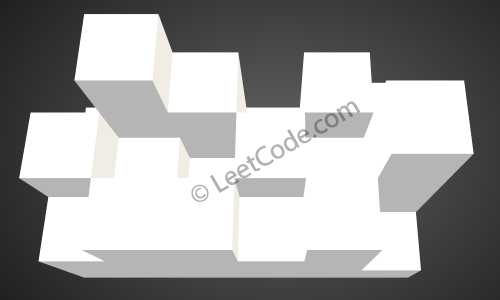

核心思想：使用`优先队列`，每次找**最容易漏水**的位置，

-----

#### 线的雨水收集算法


Example:
```
Input: [0,1,0,2,1,0,1,3,2,1,2,1]
Output: 6
```

线的雨水收集可以不用`优先队列`，因为只需要比较当前两端的位置即可。

思路：
1. 比较两端，如果`a<b`(如果`b<a`，下面则从`b`开始)
2. 从`a`开始继续遍历
    * 发现有比它高的墙`x`，说明这个`a`点的漏水被堵住了，将这个墙`x`继续更另一端的值对比`x ? b`
    * 发现有比它矮的凹口`y`，说明这个凹口`y`最多水位能升到`a`的位置，记录`a.height-y.height`，继续往下检测
    * 发现和它一样高的，同上
3. 继续两端对比，递归1


```js
var trap = function(height) {
  let leftIdx=0,rightIdx=height.length-1
  let result=0
  while(leftIdx<rightIdx){
    let leftV=height[leftIdx],rightV=height[rightIdx]
    if(leftV<rightV){
      // 左边遍历执行思路2
      while(leftIdx<rightIdx && height[++leftIdx]<=leftV){
        result+=leftV-height[leftIdx]
      }
      leftV=height[leftIdx]
    }else{
      // 右边遍历执行思路2
      while(leftIdx<rightIdx && height[--rightIdx]<=rightV){
        result+=rightV-height[rightIdx]
      }
      rightV=height[rightIdx]      
    }
  }
  return result
};
```

-----

#### 面的雨水收集算法

Example:
```
Given the following 3x6 height map:
[
  [1,4,3,1,3,2],
  [3,2,1,3,2,4],
  [2,3,3,2,3,1]
]

Return 4.
```
接水之前：



接水之后：


面的问题因为涉及4个方向的边，建议使用`优先队列`，每次取出边上的最小值处理(最容易漏水的位置)。

思路：
1. 将4条最外边的值加入`优先队列`，建立一个`visited`，表示已经探索过的区域，不重复执行
2. 取出最小值`a`，从`a`开始遍历，不过要遍历4个方向，`visited`为true的跳过，同时设置一个`max`，
    用于保存当前最矮的墙中最高的...(因为使用`优先队列`每次取出最小值)
3. 遇到比`max`高的墙，则加入到`优先队列`中，因为这个墙已经可以作为一个新的边，

    遇到不比`max`高的平面或者凹口，记录增加的水位`max - 当前凹口的高度`，继续遍历直到遇到比`a`高的。
4. 直到`优先队列`的数据全部处理完

思路视频，非常`easy`

[Visualization of priority queue algorithm.](https://www.youtube.com/watch?v=cJayBq38VYw)

```js
/**
 * @param {number[][]} heightMap
 * @return {number}
 */
var trapRainWater = function(heightMap) {

  let pq=new PriorityQueueMin()
  let visited=[]
  for(let i=0;i<heightMap.length;i++){
    visited[i]=[]
    for(let j=0;j<heightMap[0].length;j++){
      if((i>0 && i<heightMap.length-1) && (j>0 && j<heightMap[0].length-1))continue
      // 添加入优先队列的是一个数组，内部根据 heightMap[i][j] 比较
      pq.insert([i,j,heightMap[i][j]])
      visited[i][j]=true
    }
  }
  let max=-Infinity,count=0
  while(!pq.isEmpty()){
    let cur=pq.delMin()
    // 现在最矮的边(墙)已经比之前最矮的边(墙)要高
    if(cur[2]>max)max=cur[2]
    check(cur[0],cur[1])
  }
  function check(row,col){
    let step=[[-1,0],[1,0],[0,-1],[0,1]]
    for(let i=0;i<step.length;i++){
      let newR=row+step[i][0],newC=col+step[i][1]
      if((newR<0 || newR>=heightMap.length) || (newC<0 || newC>=heightMap[0].length))continue
      if(visited[newR][newC])continue
      visited[newR][newC]=true
      let newVal=heightMap[newR][newC]
      if(newVal<max){
        // 发现凹口，记录增加的水位，继续遍历
        count+=max-newVal
        check(newR,newC)
      }else{
        // 遇到更高的墙，添加到优先队列
        pq.insert([newR,newC,newVal])
      }
    }
  }

  // 优先队列
  function PriorityQueueMin(){
    /* ... */
  }
  return count
};
```