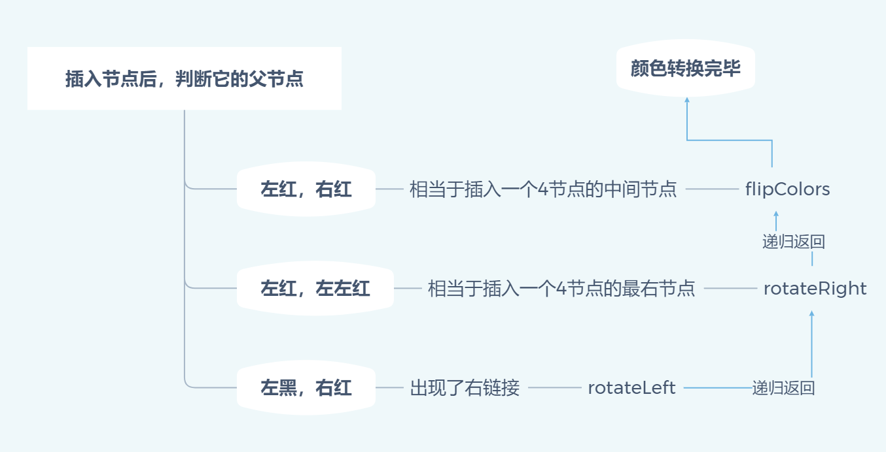
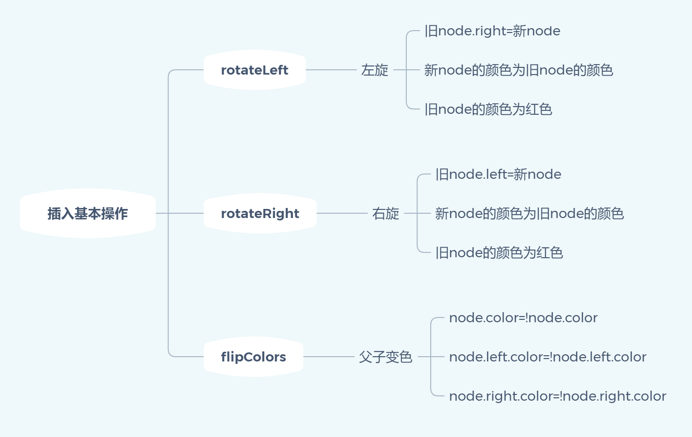

### 规则：
1. 原型是`2-3树`
2. 红链接：红链接中子节点是`红色`，父节点是`黑色`
3. 只存在红链接为左链接
4. 当节点为null，也认为是`黑色`
5. 当插入节点，出现2个左红点相邻(不可能出现2个右红点相邻，因为第3条)，其实就是`2-3树`中出现了`4节点`，需要转换。
6. 当删除节点，需要让被删除的节点为`红色`(通过转换)
7. 红黑树的插入和删除都是建议在`递归`执行的基础上

-----

### 插入：



```js
function insert(){
  // ...正常二叉树的处理
  
  // 以下三条会在递归过程中处理
  if(isRed(node.left) && isRed(node.right)) flipColors(node)
  if(!isRed(node.left) && isRed(node.right))node=rotateLeft(node)
  if(isRed(node.left) && isRed(node.left.left))node=rotateRight(node)
}
```



例(B代表`black`, R代表`red`)：

```
                              R3为右红左黑       R5为左红左左红        此时已经到达根节点，虽然左红右红，
    B5       添加4     B5      执行第二条     B5   执行第三条     B4    但不会执行第一条，留到下一次执行 
   /  \      --->     /  \      --->        /  \     --->      /  \   
  R3  Null          R3  Null              R4  Null            R3   R5   
                     \                   /                                          
                      R4               R3                                           
```


-----

### 删除：

#### 左节点

.png)

```js
if (val < node.val)  {
  // 检测左节点如果是2节点(黑色)，那么需要将它变为3节点(红色)再删除
  node=checkLeftNodeAndMove(node)
  // 继续往下执行
  node.left = _remove(node.left, val);
}else{ /* ... */}
```

 在`checkLeftNodeAndMove`内部，如果检测到左边是个`2节点`(左黑 & 左左黑)，那么先`flipColors`，这么做是为了让当前`node`先
成为一个`3节点`或者`4节点`(左红,右红?)，让左节点(`2节点`)可以通过右节点或者通过`node`去借一个红色节点(转换)，然后就去
检测右边，右边存在`3节点`(右左红)，那么就从右边借(`rotateRight + rotateLeft`)，如果右边不存在，通过递归和执行
`flipColors`，最终可以从`node`去借一个红色节点。

```js
function checkLeftNodeAndMove(node){
  // 确保左边只是个2节点
  if (!isRed(node.left) && !isRed(node.left.left))
    node= moveRedLeft(node);
  return node
}

function moveRedLeft(node) {
  // 将node变为3节点或者4节点
  flipColors(node);
  if (isRed(node.right.left)) {
    // 判断是否可以从右节点接一个红色节点
    node.right = rotateRight(node.right);
    node = rotateLeft(node);
    // 已经从右节点借到一个红色节点，解除node的多节点
    flipColors(node);
  }
  return node;
}
```

-----

#### 右节点

.png)

```js
if (val < node.val)  {
  /* ...左节点的处理... */
}else {
  // 如果是3节点，需要先右旋，保证被删除的不是父级树
  /*
  例如： 5         3
        /   ==>     \
     R 3           R 5
  */
  if (isRed(node.left))
    node = rotateRight(node);
  // 找到值，通过上面右转，无右子树，直接删除
  if (val===node.val  && (node.right == null))
    return null;

  // 检测右侧可能被删除的节点如果是2节点(黑色)，那么需要将它变为3节点(红色)再删除
  node=checkRightNodeAndMove(node)
  if (val === node.val) {
    let x = min(node.right);
    node.val = x.val;
    node.right = _remove(node.right,x.val);
  }
  else node.right =_remove(node.right, val);
}
```

 在`checkLeftNodeAndMove`内部，如果检测到右边**有可能是删除位置**的节点是个`2节点`(右黑 & 右左黑)，那么先`flipColors`，
 同样也是为了让当前`node`先成为一个`3节点`或者`4节点`，然后就去检测左边，左边存在`3节点`(左左红)，那么就从左边借
 (`rotateRight `)，如果左边不存在，通过递归和执行`flipColors`，最终可以从`node`去借一个红色节点。


```js
function checkRightNodeAndMove(node){
  // 如果右节点 或者 右节点的左孩子 为红色，这两个节点是有可能会被删除的节点，则不需要调整，可以继续递归至下一层
  if (!isRed(node.right) && !isRed(node.right.left))
  // 调整为3节点
    node = moveRedRight(node);
  return node
}

function moveRedRight(node) {
  // 将node变为3节点或者4节点
  flipColors(node);
  // 判断是否可以从左节点接一个红色节点
  if (isRed(node.left.left)) {
    node = rotateRight(node);
    // 已经从左节点借到一个红色节点，解除node的多节点
    flipColors(node);
  }
  return node;
}
```

------

#### balance

删除操作结束后，**递归**执行`balance`

检测一下内容
* 检测是否存在右红链接
* 检测是否存在2个左红链接相邻
* 检测是否存在`4节点`(左红右红)

其实就是`插入节点`的3个`if`，这两个表达意思是一模一样，可以通用(已测试)
```js
function balance(node){
  if (isRed(node.right))  node = rotateLeft(node);
  if (isRed(node.left) && isRed(node.left.left)) node = rotateRight(node);
  if (isRed(node.left) && isRed(node.right)) flipColors(node);
  return node;
}
```