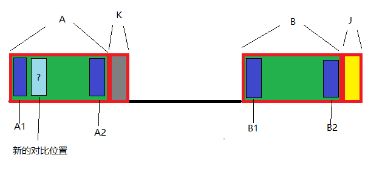

KMP算法中，当对应的字符不匹配时，需要对前一个索引进行回溯

一般写法是：
```js
function calcNext(str,pat){
  /*...*/
  if(str[k]!==str[j]){
    // 有些会写成k=next[k]，原理是一样的
    // 这里k表示，所对应当前正在进行对比的索引
    // k=next[k-1]表示找到k的前一位的公共匹配前后缀的数量，作为新的对比索引
    k=next[k-1]
  }
}
```


图中，当K和J不能匹配时，A和B是已经匹配的公共前后缀

因此A和B是完全相等

A内部的A1,A2是已经匹配的公共前后缀

B内部的B1,B2是已经匹配的公共前后缀

因此A1===A2===B1===B2

要想找到可能和J匹配的最大公共前后缀，只能找A的前缀(因为A的后缀连着k，而k不相等，所以k不能用了，只能找它前面的)，与J进行比较

也就是从`next[k-1]`开始匹配

代码：
```js
function calcNext(str){
  let i=1,k=0
  let next=[]
  next[0]=0
  while(i < str.length){
    // 不相等时
    if(str[i]!==str[k]){
      // 如果k已经是0了(最小就是0)，直接设置成0
      if(k===0)next[i++]=k
        // 否则就回溯到前一个公共前缀的位置
      else {
        k=next[k-1]
      }
    }else{
      // 相等，就直接在k的索引上+1，表示匹配的length
      next[i]=k+1
      i++;
      k++;
    }
  }
  return next
}

function kpm(str,pat){
  if(pat.length===0) return 0
  let next=calcNext(pat)
  let i=0,j=0
  while(i<str.length ){
    if(str[i]===pat[j]){
      i++;j++
      // j===pat.length说明已经匹配成功
      if(j===pat.length) return i-j
    }else{
      if(j===0){
        i++
      }else{
        j=next[j-1]
      }
    }
  }
  return -1
}
```