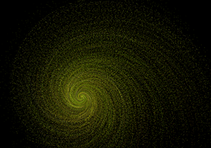
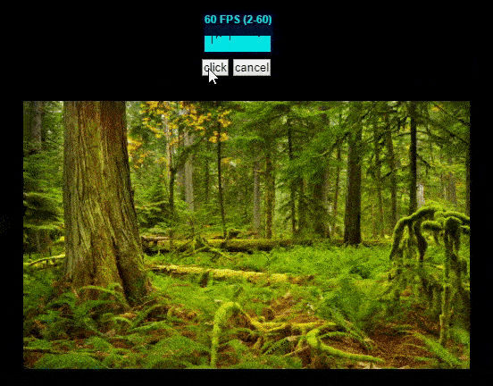

最近遇到的，目的是通过粒子动画渲染图片

图片大小为500*300，并且粒子动画细度为1，也就是粒子总量为15万，并且当动画完成后，图片能完整清晰的显示出来

最初尝试15万个粒子同时运动，结果标签页直接崩溃了，意料之中...

```js
 for (let py = 0; py < targetH; py ++) {
    for (let px = 0; px < targetW; px ++) {
      let rgba4 = (px + py * targetW) * 4 - 1
      if(rgba4<0)rgba4=3
      const rgba3=rgba4-1,rgba2=rgba3-1,rgba1=rgba2-1;
      const opacity = imgData.data[rgba4];
      if (opacity === 255) {
        const opts={
          cur:[px,py],
          end:[px,py],
          color:[imgData.data[rgba1],imgData.data[rgba2],imgData.data[rgba3],imgData.data[rgba4]],
           /* 省略：一些其他参数 */
         }
         /* 省略：对当前时间戳的处理 */
         /* 省略：对动画的处理 */
         ctx.fillStyle = `rgba(${rgba1}, ${rgba2}, ${rgba3},${rgba4}`
         ctx.fillRect(curX, curY, 1, 1);
      }
    }
  }
```

----------

后来考虑离屏吧，规定每个离屏承载量为1000(保证fps)，这么一来，75个`离屏canvas`，开始动画...奔溃了...

```js
export default function createAssignParticles(allParticles){
  // 定义每个离屏承载量
  const eachPanelParticles=1000
  const assignedParticles=[]
  const panelsSize=Math.ceil(allParticles.length/eachPanelParticles)
  for(let i=0;i<panelsSize;i++){
    // 创建离屏canvas
    const  canvas = document.createElement('canvas');
    canvas.width=window.outerWidth
    canvas.height=window.outerHeight;
    const ctx=canvas.getContext('2d')
    // 后渲染的在上层
    ctx.globalCompositeOperation='destination-over'
    // 取消抗锯齿
    ctx.imageSmoothingEnabled = false;
    ctx.mozImageSmoothingEnabled = false;
    ctx.webkitImageSmoothingEnabled = false;
    assignedParticles[i]={
      sourceArr:[],
      canvas,
      ctx,
    }
  }
  // 乱序将每个粒子平均插入每个离屏canvas
  for(let i=0;i<allParticles.length;i++){
    const putInWhichPanel=Math.floor(Math.random()*(panelsSize-0.01))
    assignedParticles[putInWhichPanel].sourceArr.push(allParticles[i])
  }
  return assignedParticles
}

// 执行动画函数内部
for(let i=0;i<assignedParticles.length;i++){
  let cur=assignedParticles[i].sourceArr
  for(let j=0;j<cur.length;j++){
     /* 省略：对当前时间戳的处理 */
     /* 省略：对动画的处理 */
     ctx.fillStyle = `rgba(${rgba1}, ${rgba2}, ${rgba3},${rgba4}`
     ctx.fillRect(curX, curY, 1, 1);
  }
}
```

毕竟同时运动的总量还是15万个粒子...

既然不能同时运动，那么就分批运动总行了吧

----------

每个`离屏canvas`执行完毕，递归调用下一个`离屏canvas`，但这样又出现一个新的问题，

如果每个`离屏canvas`执行后，清除显示用的画布，那么动画只是会出现每一个离屏的动画，上一个离屏动画的结果并未保存。

如果不清除显示的画布，那么每个`离屏canvas`会有轨迹，造成模糊(虽然也挺好看，但不是需要的效果)。


```js
import raf from 'raf'
import {spiral,fadeIn,explode} from './animations-control/core'
import stopIfNeed from './animations-control/stopIfNeed'
import lastRenders from './animations-control/lastRenders'


export default function play(assignedParticles,c_showMotion,ctx_showMotion,options,doneCallBack){
  /* 省略：获取会用到的参数*/
  let allParticlesIdx=0
  recursionExec(allParticlesIdx)
  function  recursionExec(allParticlesIdx){
    let arrs=assignedParticles[allParticlesIdx].sourceArr
    let ctx=assignedParticles[allParticlesIdx].ctx
    let canvas=assignedParticles[allParticlesIdx].canvas
    let doneNum=0
    let rafHandle
    let msPerFrame=1000/60
    function startIfNeed(){
      rafHandle= raf(function playing(timestamp){
       /* 省略：判断当前离屏canvas是否结束 */
       
       // 执行当前离屏canvas
      ctx.clearRect(0, 0, canvasW, canvasH)
      ctx.beginPath();
      for (let k = 0; k < arrs.length; k++) {
        let {cur,end} = arrs[k]
        /* 省略：判断当前粒子是否需要停止*/
        /* 省略：对当前时间戳的处理 */
        /* 省略：对动画的处理 */
        
        ctx.fillStyle = `rgba(${rgba1}, ${rgba2}, ${rgba3},${rgba4}`
        ctx.fillRect( curX,  curY, 1, 1);
      }
      // 此处ctx_showMotion是显示用的canvas，
      // 如果不使用clearRect，那么会出现轨迹
      // 如果使用clearRect，那么每次执行的动画结果不会被保存
      // ctx_showMotion.clearRect(0,0,canvasW,canvasH)
      ctx_showMotion.drawImage(canvas ,0, 0,)
        
        raf(playing)
      })
      ctx_storeStatus.drawImage(c_showMotion,0,0)
    }
    startIfNeed()
  }
}
```

----------

最后考虑用2张画布显示，第一个清除并且显示当前`离屏canvas`，第二个用来保存第一个的结果

```
      /* 省略：前面参数多了一个ctx_storeStatus，其他一致 */
        ctx.fillStyle = `rgba(${rgba1}, ${rgba2}, ${rgba3},${rgba4}`
        ctx.fillRect( curX,  curY, 1, 1);
      }
      // 此处ctx_showMotion是显示用的canvas，
      // 如果不使用clearRect，那么会出现轨迹
      // 如果使用clearRect，那么每次执行的动画结果不会被保存
      // ctx_showMotion.clearRect(0,0,canvasW,canvasH)
      ctx_showMotion.drawImage(canvas ,0, 0,)
        raf(playing)
      })
      // 专门用于保存ctx_showMotion处理结果的canvas画布
      ctx_storeStatus.drawImage(c_showMotion,0,0)
    }
    startIfNeed()
  }
}
```

最终效果如下：



可以看到fps平均在45-50之间

-------

总结：

充分利用canvas的画布，将对粒子进行`fill`的动画转换成对`离屏canvas`进行`drawImage`的处理
