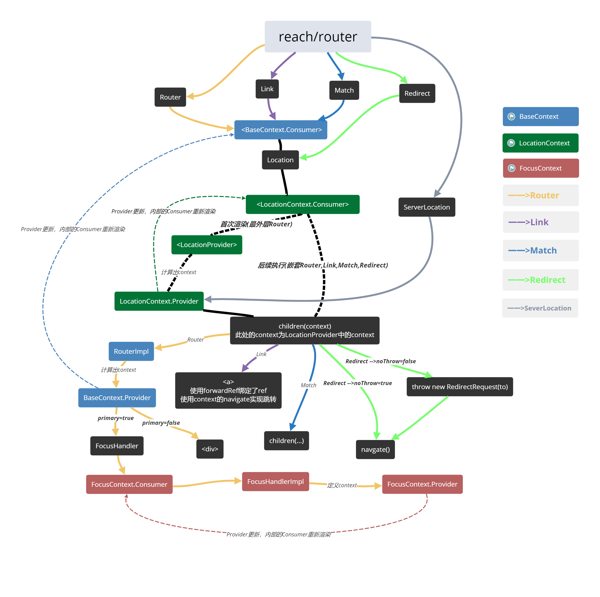

## reach/router

[完整源码说明注释](https://github.com/stonehank/source-code.reach-router)

一张导图：



几个亮点：

* 匹配顺序

源码中是使用了一个评分的方法：
1. 先对路径去除头尾的`/` ，并且按`/`分割成路径片段数组
2. 对数组使用reduce方法计算分值，如下：
```
let SEGMENT_POINTS = 4;     // 基本分值，每一个路径片段都有
let STATIC_POINTS = 3;      // 静态路径，如：/abc
let DYNAMIC_POINTS = 2;     // 动态路径，如：/:section
let SPLAT_PENALTY = 1;      // 通配符（减分），如：/*，此处遇到通配符会先减去基本分值，再减1分（优先权很低）
let ROOT_POINTS = 1;        // 根路径
```
可知优先权排序为：

静态路径 > 动态路径 > 根路径 > 通配符

* 相对路径

涉及到3个方法：

`./index.js-->createRoute`

`./lib/utils.js-->resolve`

`./lib/util.js-->pick`

首先是通过`basepath`(一个Router自定义属性，用作路径的公共前缀)结合每一个children(即Route Component)的path通过`createRoute`方法计算出一个绝对路径

再通过`pick`方法与当前`pathname`(即window.location.pathname)进行匹配，计算得出一个非通配(*)路径匹配值(baseuri)，`例如：'a/*' -->匹配出 basuri:'/a'`

这个baseuri会作为`BaseContext`(React.createContext)的context传递给内部组件，最后使用`resolve`方法对Link上的to的路径(可能是绝对路径，也可能是相对路径)搭配`baseuri`进行解析(转换成绝对路径)，并且跳转


* 自动focus

对屏幕阅读器特别友好，每次通过Link跳转后，会自动focus到当前跳转对应的Component，也就是不需要再通过大量的tab按钮去寻找内容页面
